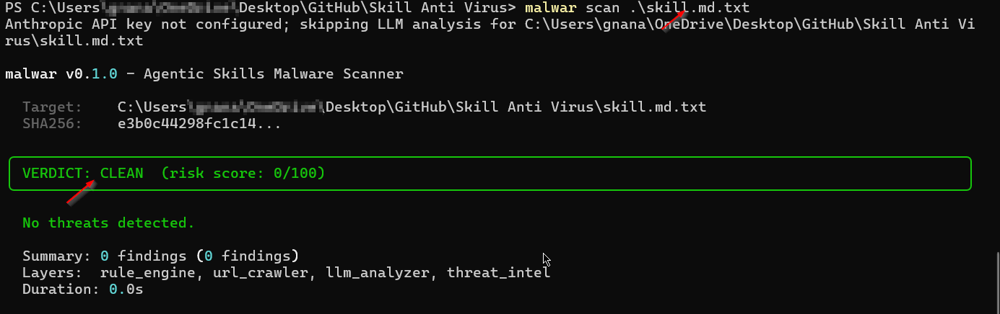

# Getting Started with Malwar for Claude Code

Claude Code uses SKILL.md files to extend its capabilities. Because these files can execute shell commands, They pose a serious risk to your system's security. A malicious skill file could contain hidden commands designed to:
* Exposing sensitive credentials
* Delete local files or modify system configurations.
* Install backdoors on your machine.

Malwar allows you to verify these files with a risk verdict.
---

## 1. Installation
Install the package via pip and initialize the local threat database to ensure you have the latest detection rules.

```bash
pip install malwar
malwar db init
```

## 2. Scanning a Skill before Installing
Before moving a third-party skill into your .claude/commands/ directory, run a scan. You can scan a skill file directly from a URL (e.g., from a GitHub repository) or from a file you have already downloaded.

Scan a Local File

``` Bash
malwar scan ./path/to/your-skill.md
```


Scan a Remote URL

``` Bash
malwar scan [https://example.com/path/to/remote-skill.md](https://example.com/path/to/remote-skill.md)
```
 
## 3. Understanding Results
Malwar categorizes files based on a **risk score (0-100)**. Use the table below to determine your next steps:

|VerdictRisk |LevelRecommended |Action |
| :-- | :-- | :-- |
|CLEAN |Low (0-20) |Safe to install in your Claude commands folder. |
|SUSPICIOUS |Medium (21-60) | Review flagged lines; check for unusual shell commands. |
|MALICIOUS | High (61+) | Do not install. Potential data exfiltration or harmful scripts. |



## 4. Safe Installation Workflow
To maintain a secure environment, adopt this two-step process:

Download: Save the new .md skill to a temporary folder.

Scan: 
```Bash
Run malwar scan <filename>.
```

If the verdict is CLEAN, move it to your Claude configuration

## Advanced: Registry Crawling
If you are exploring a repository like ClawHub, you can scan an entire registry or a specific slug using the crawl feature:

```Bash
# Scan by slug
malwar crawl scan <slug-name>

# Scan by repository URL
malwar crawl url <repository-url>